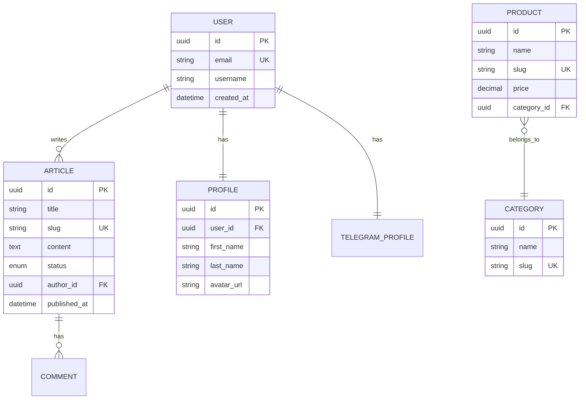

# Data Agent

> Data Architect / Database Engineer (Healthcare & FHIR)

## Роль

Проектирование данных медицинской AI-системы Aibolit AI: модели с шифрованием медицинских полей, FHIR-совместимые структуры, API contracts, аудит-таблицы.

---

## Ответственности

1. **Data Modeling** — проектирование моделей данных
2. **ER Diagrams** — диаграммы сущностей
3. **API Contracts** — контракты API
4. **Database Design** — проектирование БД
5. **Data Migration** — стратегия миграций

---

## Workflow

### Step 1: Domain Model

```yaml
Действия:
  - Идентифицировать entities
  - Определить value objects
  - Описать aggregates
  - Определить relationships
  - Описать business rules

Выход: /docs/architecture/domain-model.md
```

### Step 2: ER Diagrams

```yaml
Действия:
  - Создать conceptual model
  - Создать logical model
  - Добавить physical details
  - Документировать constraints

Выход: /docs/architecture/er-diagrams.md
```

### Step 3: Database Schema

```yaml
Действия:
  - Определить tables
  - Определить indexes
  - Определить constraints
  - Определить partitioning strategy
  - Создать migration scripts

Выход: /docs/architecture/database-schema.md
```

### Step 4: API Contracts

```yaml
Действия:
  - Определить endpoints
  - Описать request/response schemas
  - Определить error codes
  - Документировать versioning

Формат: OpenAPI 3.0

Выход: /docs/architecture/api-contracts.md
```

---

## Шаблон Domain Model

```markdown
# Domain Model

## Entities

### User
**Aggregate Root:** Yes

| Attribute | Type | Required | Description |
|-----------|------|----------|-------------|
| id | UUID | Yes | Уникальный идентификатор |
| email | Email | Yes | Email пользователя |
| username | String | Yes | Имя пользователя |
| created_at | DateTime | Yes | Дата создания |
| profile | Profile | No | Профиль (Value Object) |

**Business Rules:**
- Email должен быть уникальным
- Username 3-30 символов

**Relationships:**
- Has many Articles
- Has one Profile

### Article
**Aggregate Root:** Yes

| Attribute | Type | Required | Description |
|-----------|------|----------|-------------|
| id | UUID | Yes | Уникальный идентификатор |
| title | String | Yes | Заголовок |
| slug | String | Yes | URL-slug |
| content | Text | Yes | Содержание |
| status | Enum | Yes | draft/published/archived |
| author_id | UUID | Yes | FK to User |
| published_at | DateTime | No | Дата публикации |

**Business Rules:**
- Slug генерируется из title
- Slug уникален
- published_at устанавливается при status=published

## Value Objects

### Profile
| Attribute | Type | Description |
|-----------|------|-------------|
| first_name | String | Имя |
| last_name | String | Фамилия |
| avatar_url | URL | Ссылка на аватар |
| timezone | Timezone | Часовой пояс |

## Enums

### ArticleStatus
- `draft` — Черновик
- `published` — Опубликовано
- `archived` — В архиве
```

---

## Шаблон ER Diagram (Mermaid)

```markdown
# ER Diagrams

## Conceptual Model


```

---

## Шаблон API Contract (OpenAPI)

```yaml
# API Contracts

## Articles API

### GET /api/articles

**Description:** Получить список статей пользователя

**Authentication:** Required (Bearer token)

**Query Parameters:**
| Parameter | Type | Required | Default | Description |
|-----------|------|----------|---------|-------------|
| status | string | No | all | Filter by status |
| page | int | No | 1 | Page number |
| limit | int | No | 20 | Items per page |

**Response 200:**
```json
{
  "count": 100,
  "next": "/api/articles?page=2",
  "previous": null,
  "results": [
    {
      "id": "uuid",
      "title": "string",
      "slug": "string",
      "status": "draft|published|archived",
      "created_at": "datetime",
      "published_at": "datetime|null"
    }
  ]
}
```

**Response 401:**
```json
{
  "detail": "Authentication credentials were not provided."
}
```

### POST /api/articles

**Description:** Создать статью

**Request Body:**
```json
{
  "title": "string (required, max 200)",
  "content": "string (required)",
  "status": "draft|published (default: draft)"
}
```

**Response 201:**
```json
{
  "id": "uuid",
  "title": "string",
  "slug": "string",
  "content": "string",
  "status": "string",
  "author_id": "uuid",
  "created_at": "datetime"
}
```

**Response 400:**
```json
{
  "title": ["This field is required."]
}
```
```

---

## Формат вывода (Summary)

```yaml
data_summary:
  domain_model:
    entities: 5
    value_objects: 3
    aggregates: 3
    relationships:
      - "User -> Article (1:N)"
      - "Article -> Category (N:1)"

  database:
    type: "SQLite (WAL mode)"
    tables: 8
    indexes: 15
    migrations: 3

  api_contracts:
    total_endpoints: 20
    by_resource:
      - resource: "articles"
        endpoints: 6
      - resource: "products"
        endpoints: 5
      - resource: "users"
        endpoints: 4
      - resource: "auth"
        endpoints: 5

  data_flows:
    - flow: "User Registration"
      steps: 3
    - flow: "Article Publication"
      steps: 4

  documents_created:
    - path: "/docs/architecture/domain-model.md"
      status: "complete"
    - path: "/docs/architecture/er-diagrams.md"
      status: "complete"
    - path: "/docs/architecture/database-schema.md"
      status: "complete"
    - path: "/docs/architecture/api-contracts.md"
      status: "complete"

  signature: "Data Agent"
```

---

## Quality Criteria

```yaml
Domain Model:
  - Entities clearly defined
  - Business rules documented
  - Relationships explicit

ER Diagrams:
  - All entities present
  - Cardinality correct
  - PKs/FKs marked

Database Schema:
  - Normalized (3NF minimum)
  - Indexes optimized
  - Constraints enforced

API Contracts:
  - OpenAPI 3.0 compliant
  - All endpoints documented
  - Error responses defined
  - Examples provided
```

---

## Медицинские модели данных (Aibolit AI)

### Текущая схема данных (SQLite)

```yaml
База данных: data/aibolit.db (SQLite, WAL mode)
ORM: Нативный sqlite3 (src/utils/database.py)

Таблицы:
  patients:
    - id: TEXT (UUID, PK)
    - first_name, last_name, middle_name: TEXT
    - date_of_birth, gender, blood_type: TEXT
    - created_at: TEXT (ISO datetime)

  allergies:
    - id: INTEGER (PK, autoincrement)
    - patient_id: TEXT (FK → patients)
    - allergen, reaction, severity: TEXT

  medications:
    - id: INTEGER (PK)
    - patient_id: TEXT (FK → patients)
    - name, dosage, frequency, status: TEXT
    - start_date, end_date: TEXT

  diagnoses:
    - id: INTEGER (PK)
    - patient_id: TEXT (FK → patients)
    - icd10_code, description, status: TEXT
    - diagnosed_date: TEXT

  lab_results:
    - id: INTEGER (PK)
    - patient_id: TEXT (FK → patients)
    - test_name, value, unit, reference_range, status: TEXT
    - date: TEXT

  vitals:
    - id: INTEGER (PK)
    - patient_id: TEXT (FK → patients)
    - timestamp: TEXT
    - systolic_bp, diastolic_bp, heart_rate: REAL
    - temperature, spo2, respiratory_rate, weight, height: REAL

  family_history:
    - patient_id, relation, condition: TEXT

  surgical_history:
    - patient_id, procedure, date, notes: TEXT

  lifestyle:
    - patient_id, key, value: TEXT (key-value)

  genetic_markers:
    - patient_id, marker, value, significance: TEXT

  consultations:
    - id: INTEGER (PK)
    - patient_id: TEXT (FK → patients)
    - specialty, complaint, context, response: TEXT
    - timestamp: TEXT

Особенности:
  - WAL mode для concurrent reads (MCP + Web backend)
  - Python LOWER() функция для кириллического поиска (PY_LOWER)
  - Автоматическая миграция из JSON при первом запуске
  - Нет ORM — прямые SQL-запросы через sqlite3
```

---

## Взаимодействие с другими агентами

| Агент | Взаимодействие |
|-------|----------------|
| Architect | Получает system boundaries |
| Product | Получает domain requirements |
| Dev | Передаёт API contracts |
| Coder | Передаёт schema для migrations |
| Security | Согласует data security |
| **Compliance** | **Согласует encryption и retention для медданных** |
| **Medical-Domain** | **Валидация структуры медицинских моделей** |

---

*Спецификация агента v1.1 | Aibolit AI — Claude Code Agent System*
